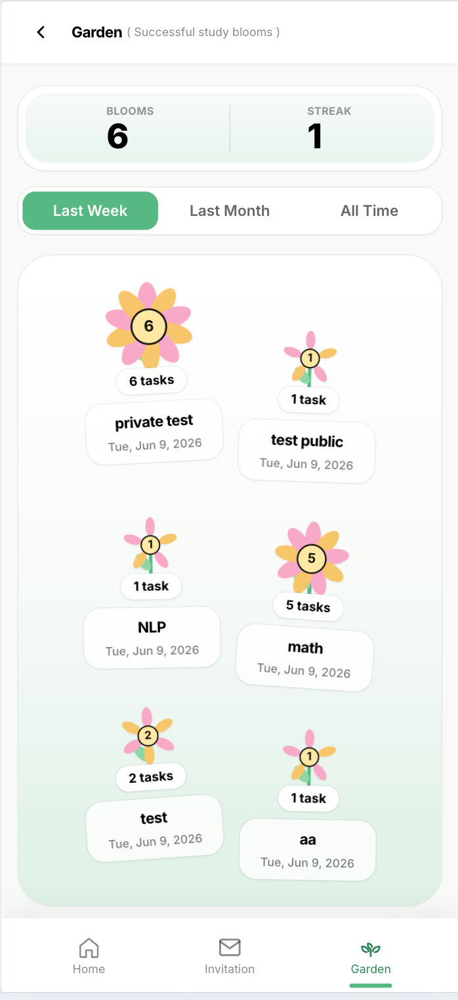

# Bloom Together

A collaborative focus app where students grow virtual flowers by completing shared study sessions. HCI course hi-fi prototype — PYNS team, Politecnico di Torino 2025.

---

<table>
  <tr>
    <td valign="top" width="55%">

## How it works

Users host or join timed co-study sessions. Everyone in a session works at the same time, sees the same timer, and manages their own to-do list. When the session ends successfully, each participant earns a flower in their garden. The garden and streak counter are the only persistence across sessions — there are no accounts to create.

- **Public sessions** — visible to everyone on the Available Sessions page; anyone can join
- **Private sessions** — invite-only; the host sets shared tasks that all participants see
- **AI to-do panel** — generates 5 static task templates per session on demand
- **Flower growth animation** — visible during the session as a live progress indicator
- **Garden** — shows flowers earned from completed sessions; powers the streak counter

  </td>
    <td valign="top" align="center" width="45%">
      <br/>
      <sub>Home dashboard — streak, total blooms, and quick actions</sub>
    </td>
  </tr>
</table>

---

## Quick start

Two processes must run simultaneously.

```bash
npm install
```

**Terminal 1 — frontend (port 5173):**
```bash
npm run dev
```

**Terminal 2 — backend (port 3001):**
```bash
node src/backend/server.js
```

Open `http://localhost:5173`. The Vite dev server proxies all `/api/*` requests to `http://localhost:3001` — no CORS configuration needed.

**Default login:** `mario` / `12345`

---

## Changing the test user

Edit `src/backend/users.txt` before starting the server:

```
username=yourname pass=yourpassword
```

The server reads this file at startup. If the file is empty or missing, it falls back to `mario`/`12345`. Only one real user is supported at a time — the app is designed for single-user usability testing with simulated friends.

---

## Tech stack

| | |
|---|---|
| Frontend | Vue 3 (`<script setup>` Composition API) |
| Routing | vue-router 4 — `createWebHistory()` |
| State | Pinia |
| Styling | Tailwind CSS 3 |
| Build | Vite (rolldown-vite 7) |
| Backend | Express 5, Node.js ESM |
| Database | SQLite via better-sqlite3 |

---

## Project structure

```
src/
  pages/
    IntroPage.vue          # Login / landing
    Home.vue               # Dashboard: streak, blooms, quick actions
    AvailableSessions.vue  # Browse and join public sessions
    HostSession.vue        # Create public or private session
    SessionRoom.vue        # Active session: timer, to-do, flower, friends
    Invitation.vue         # Accept/view private session invite
    Garden.vue             # Flower collection and history

  components/
    AvailableSessions/
      SessionCard.vue      # Single session card with join button
      FilterBar.vue        # Topic search + duration filter trigger
      DurationFilter.vue   # Duration range filter panel
    HostSession/           # Session creation form components
    session/
      SessionTimer.vue     # Countdown/elapsed timer display
      FlowerGrowth.vue     # Animated flower SVG during session
      TodoDrawer.vue       # Bottom drawer for personal to-do list
      TodoListPanel.vue    # To-do item list and add row
      TodoAddRow.vue       # Inline add-task input
      AiTodoPanel.vue      # AI-generated task suggestions panel
      FriendsProgressFlowers.vue  # Friends' flower progress during session
      EndSessionModal.vue  # Confirm end + success/fail outcome
      PopQuizModal.vue     # Optional pop quiz during session
      AddPeopleModal.vue   # Invite friends to session
    main/
      Header.vue           # Top bar
      NavBar.vue           # Bottom navigation
      BottomSheet.vue      # Generic bottom sheet wrapper
    icons/

  backend/
    server.js              # All Express routes + SQLite logic
    users.db               # Pre-seeded SQLite database
    users.txt              # Optional: override real-user credentials

  Api/
    http.js                # fetch() wrapper — reads VITE_API_BASE env var
  router/
    index.js               # Route definitions
```

---

## Routes

| Path | Page |
|---|---|
| `/` | Intro / login |
| `/home` | Dashboard |
| `/sessions` | Available sessions |
| `/host` | Create session |
| `/room/:id` | Active session room |
| `/invitation` | Private session invitation |
| `/garden` | Flower garden |

---

## API reference

All endpoints are served by `src/backend/server.js` on port 3001.

### Users

| Method | Endpoint | Description |
|---|---|---|
| `GET` | `/api/users` | List all users (no passwords) |
| `GET` | `/api/users/:username` | Get user profile |
| `PUT` | `/api/users/:username` | Update `password`, `flowers`, `focus_time`, or `config` |
| `GET` | `/api/friends` | List fake (non-real) users for the invitation picker |

### Sessions

| Method | Endpoint | Description |
|---|---|---|
| `GET` | `/api/sessions` | List all active (not ended) sessions |
| `POST` | `/api/sessions` | Create a session |
| `GET` | `/api/sessions/completed` | List successfully completed sessions (for garden) |
| `GET` | `/api/sessions/:id` | Get one session by ID |
| `PUT` | `/api/sessions/:id` | Update session fields (todos, participants, etc.) |
| `POST` | `/api/sessions/:id/end` | End a session; body `{ success: true/false }` |
| `POST` | `/api/sessions/:id/ai/generate` | Generate 5 AI task templates and persist them |
| `PUT` | `/api/sessions/:id/ai/todos` | Toggle AI task done/undone (text is read-only) |

### Debug / demo

| Method | Endpoint | Description |
|---|---|---|
| `GET` | `/api/demo/invitations` | Create and return a demo private session invite |
| `GET` | `/api/db/tables` | List all SQLite tables |
| `GET` | `/api/db/table/:name` | Dump all rows from a table |

---

## Database schema

**`users`**

| Column | Type | Notes |
|---|---|---|
| `id` | INTEGER PK | Auto-increment |
| `username` | TEXT UNIQUE | |
| `password` | TEXT | Plaintext (prototype only) |
| `flowers` | INTEGER | Total flowers earned |
| `focus_time` | INTEGER | Default session minutes (25) |
| `config` | TEXT | JSON blob for user preferences |
| `is_real` | INTEGER | `1` = real user, `0` = simulated friend |

**`sessions`**

| Column | Type | Notes |
|---|---|---|
| `id` | TEXT PK | UUID |
| `privacy` | TEXT | `"public"` or `"private"` |
| `topic` | TEXT | Session title |
| `duration_hours` | INTEGER | |
| `duration_minutes` | INTEGER | |
| `admin_user_id` | INTEGER FK | References `users.id` |
| `start_time` | INTEGER | Unix ms timestamp |
| `invited_ids` | TEXT | JSON array of user IDs |
| `todos` | TEXT | JSON array — shared tasks (private sessions only) |
| `personal_todos` | TEXT | JSON array — per-user tasks (all sessions) |
| `ai_todos` | TEXT | JSON array — AI-generated tasks (toggle-only) |
| `ai_generated` | INTEGER | `1` if AI tasks have been generated for this session |
| `ended_at` | INTEGER | Unix ms when session ended; NULL = still active |
| `completion_success` | INTEGER | `1` if session was ended successfully |

Schema migrations run automatically at startup via `ensureColumn()` — safe to run against an existing DB.

---

## Session rules (enforced server-side)

- In **public sessions**, `todos` (shared tasks) are ignored; only `personal_todos` can be updated.
- In **private sessions**, both `todos` and `personal_todos` are editable.
- `ai_todos` can only be toggled done/undone. Text cannot be changed after generation.
- Only the real user (`is_real = 1`) can be the session admin. The 10 fake users simulate friends and pre-existing sessions.

---

## Screenshots

### Getting started

<table>
  <tr>
    <td align="center" valign="top">
      <br/>
      <sub><b>Login</b><br/>Enter your username and password to get started. No account creation needed — credentials are pre-configured for testing.</sub>
    </td>
    <td align="center" valign="top">
      <br/>
      <sub><b>Browse sessions</b><br/>See all active public study sessions. Filter by topic or duration and join with one tap.</sub>
    </td>
    <td align="center" valign="top">
      <br/>
      <sub><b>Invitations</b><br/>Private session invites appear here. See the host, topic, duration, and shared task list before accepting.</sub>
    </td>
  </tr>
</table>

### Hosting a session

<table>
  <tr>
    <td align="center" valign="top">
      <br/>
      <sub><b>Host — public</b><br/>Set a topic and duration. Public sessions are open to everyone and appear on the Available Sessions page immediately.</sub>
    </td>
    <td align="center" valign="top">
      <br/>
      <sub><b>Host — private</b><br/>Invite specific friends and add shared tasks the whole group will work through together.</sub>
    </td>
    <td align="center" valign="top">
      <br/>
      <sub><b>Manage participants</b><br/>The session admin can add or remove invited participants before and during the session.</sub>
    </td>
  </tr>
</table>

### Inside a session

<table>
  <tr>
    <td align="center" valign="top">
      <br/>
      <sub><b>Session room</b><br/>The main room shows the timer, your growing flower, and friends' progress. Everyone studies at the same time.</sub>
    </td>
    <td align="center" valign="top">
      <br/>
      <sub><b>Personal to-do</b><br/>Add your own tasks during any session. Check them off as you go — they belong to you, not the group.</sub>
    </td>
    <td align="center" valign="top">
      <br/>
      <sub><b>Shared tasks (private)</b><br/>In private sessions the admin manages a shared task list visible to all participants.</sub>
    </td>
  </tr>
</table>

### AI task panel

<table>
  <tr>
    <td align="center" valign="top">
      <br/>
      <sub><b>Generated tasks</b><br/>Tap "Generate" to get 5 AI-suggested study tasks tailored to the session topic. Generated once per session.</sub>
    </td>
    <td align="center" valign="top">
      <br/>
      <sub><b>Add AI task</b><br/>Select any AI suggestion to add it to your personal to-do list. Task text is fixed — only the done state can be toggled.</sub>
    </td>
    <td align="center" valign="top">
      <br/>
      <sub><b>AI quiz popup</b><br/>A pop quiz can appear mid-session to check understanding. Answer correctly to keep your streak intact.</sub>
    </td>
  </tr>
</table>

### Session outcomes & garden

<table>
  <tr>
    <td align="center" valign="top">
      <br/>
      <sub><b>Session complete</b><br/>Finishing a session successfully earns a flower. The result is recorded and shown in your garden.</sub>
    </td>
    <td align="center" valign="top">
      <br/>
      <sub><b>Session incomplete</b><br/>Ending early marks the session as incomplete. No flower is earned, but your streak resets gracefully.</sub>
    </td>
    <td align="center" valign="top">
      <br/>
      <sub><b>Garden</b><br/>Your flower collection — one flower per completed session. The garden powers the day streak counter on the home screen.</sub>
    </td>
  </tr>
</table>

---

## Seed data

On every server start, 5 public demo sessions are created (replacing any previous ones with the same topics) so the Available Sessions page is always populated. The sessions are started at `Date.now()` so they appear active immediately.

Demo session topics: Algebra group, Physics drills, Chem revision, AI Study Group, Exam Practice.

---

## Production build

```bash
npm run build
```

Output goes to `dist/`. Set `VITE_API_BASE` to your backend URL before building:

```bash
VITE_API_BASE=https://your-backend.com npm run build
```

The backend must be deployed separately and have CORS configured for your frontend domain.
